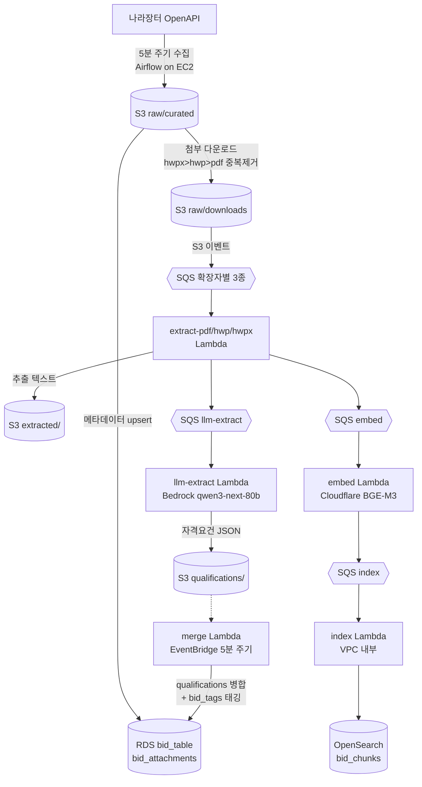

# bidmate-pipeline

나라장터(조달청) 입찰공고를 **수집 → 첨부 추출 → LLM 자격요건 추출 → 임베딩·인덱싱 → RDS 병합**까지
자동으로 처리하는 데이터 파이프라인입니다. 서빙 API(`bidmate-backend`)와 프론트(`bidmate-frontend`)가
읽는 `bid_table`·`bid_attachments`·`bid_tags`와 OpenSearch 인덱스를 이 레포가 채웁니다.

- **실시간 경로**: 5분 주기 Airflow 수집 → S3 이벤트 → SQS+Lambda 체인 (신규 공고)
- **백필 경로**: 과거 공고 대량 처리 — S3 Batch Operations로 같은 추출·LLM 로직을 일괄 실행

## 역할 분담

| 이름 | 담당 |
|---|---|
| **주대성** | PDF 파싱 · 실시간 파이프라인(청킹·임베딩·인덱싱, LLM 자격요건 추출) · AWS 아키텍처(SQS+Lambda) 설계 |
| **이종범** | HWP·HWPX 파싱 · 백필 데이터 처리 |
| **고준섭** | 첨부파일 다운로드 파이프라인 |
| **강태주** | 나라장터 API 원본 수집·적재 파이프라인 |
| **김승재** | DB 구조 설계·구축 |

## 아키텍처



전 구간 비동기·이벤트 드리븐이며, 각 SQS 큐는 DLQ를 가집니다. 실패한 적재는 커서가
전진하지 않아 다음 실행이 자동 재처리합니다(self-healing).

## 데이터 흐름

1. **수집** — `bidding_daily_pipeline` DAG(5분 주기, EC2 Airflow)이 나라장터 OpenAPI를 호출해
   원본 113필드를 `raw/raw/daily/`에, 47필드 큐레이션본을 `raw/curated/daily/`에 저장.
   30분 이상 수집 공백은 따라잡지 않고 gap 매니페스트로 기록 후 커서 리셋.
2. **첨부 다운로드** — 확장자 우선순위(hwpx > hwp > pdf)로 중복 제거, zip 해제,
   DRM(`SCDS`) 차단 후 `raw/downloads/daily/.../{bid_id}/{bid_id}_docNN.ext`로 익명화 저장.
3. **메타데이터 적재** — `db/load_curated_daily_to_rds.py`가 `bid_table`·`bid_attachments`에
   증분 upsert. RDS 전용 커서를 별도로 둬서 적재 실패 구간을 자동 재처리.
4. **텍스트 추출** — S3 이벤트 → 확장자별 SQS → `realtime-extract-{pdf,hwp,hwpx}` Lambda가
   페이지 단위 JSON으로 추출(`extracted/`), 이후 LLM 큐와 임베딩 큐에 동시 발행.
5. **자격요건 추출(LLM)** — `realtime-llm-extract` Lambda가 Bedrock(`qwen3-next-80b`,
   OpenAI 호환 엔드포인트)으로 자격요건 18개 항목을 근거(evidence)와 함께 구조화 추출
   (`qualifications/`).
6. **임베딩·인덱싱** — 청킹 후 Cloudflare Workers AI(BGE-M3)로 임베딩(`vectors/`) →
   VPC 내부 index Lambda가 OpenSearch `bid_chunks`에 벌크 인덱싱. 본문 검색은 OpenSearch,
   메타데이터는 Postgres가 담당.
7. **병합** — `realtime-merge` Lambda(EventBridge 5분 주기)가 `qual_status`가
   pending/partial/failed인 공고의 첨부별 추출 결과를 병합 규칙(텍스트는 최장값,
   enum/수치는 근거 우선, 지역·배점은 그룹 원자성)으로 합쳐 `bid_table`의 자격요건
   18컬럼을 갱신. 같은 Lambda가 `bid_tags` 품목 태깅도 수행.
8. **통계** — `bid_stats_refresh` DAG(매일 04:00 KST)이 `/stats` 화면용
   materialized view(`institution_parent`, `bid_stats`)를 갱신.

**백필 경로**: 과거 공고는 비동기 수집기(호출 예산 95,000건)로 `*/backfill/` 프리픽스에
적재 후, S3 Batch Operations가 확장자별 추출 Lambda와 LLM Lambda(Bedrock Converse)를
매니페스트 기반으로 일괄 호출합니다. 실시간과 같은 파싱 라이브러리를 공유합니다.

## 디렉터리

| 디렉터리 | 역할 |
|---|---|
| `ingestion/` | 나라장터 API 수집기 + Airflow DAG 2종 + docker-compose (EC2 운영) |
| `pipeline/realtime/` | 실시간 SAM 스택 — Lambda 7종, SQS 6쌍(+DLQ), CloudWatch 알람 10종 |
| `pipeline/backfill/` | 백필 LLM 추출 SAM 스택 (S3 Batch 호출) |
| `backfill_lambda/` | 백필 텍스트 추출 Lambda 3종 + 매니페스트 생성 (루트 `template.yaml`) |
| `parsing/` | HWP·HWPX·HWPML·PDF 추출 라이브러리 (실시간·백필 공용) |
| `db/` | 스키마 SSOT(`db/schema/*.sql`) + RDS 적재·백필 스크립트 |
| `clustering/` | 품목 태깅 모델 학습 실험 — 산출물을 실시간 태거가 사용 |
| `embedding/`, `experiments/` | 청킹·임베딩·검색 품질 실험 (BM25/kNN/하이브리드 평가) |
| `alembic/` | API 소유 테이블 전용 마이그레이션 (`bid_table` 등 파이프라인 소유 테이블은 제외) |
| `tests/` + 각 스택별 `tests/` | 추출기·라우터·병합 로직·핸들러 단위/통합 테스트 |

`preprocessing/`·`agents/`·`transforming/`·`loading/`은 초기 스캐폴딩 또는 실시간 스택으로
대체된 레거시입니다.

## AWS 구성 (v1 운영 기준)

| 서비스 | 용도 |
|---|---|
| S3 (`bidmate`) | 원본·큐레이션·첨부·추출·자격요건·벡터 전 단계 저장소 (Hive 스타일 파티션) |
| EC2 | Airflow 2.10 (LocalExecutor, docker-compose) |
| Lambda | 실시간 7종 + 백필 4종, 전부 ECR 컨테이너 이미지(digest 고정) |
| SQS | 확장자별 추출 3 + LLM + 임베딩 + 인덱싱, 각 큐에 DLQ |
| EventBridge | 병합 배치 5분 주기 트리거 |
| S3 Batch Operations | 백필 대량 추출·LLM 호출 |
| RDS PostgreSQL | `bid_table`·`bid_attachments`·`bid_tags` + 통계 matview |
| Bedrock | 자격요건 추출 LLM (`qwen.qwen3-next-80b-a3b`, us-east-1) |
| OpenSearch | 공고 본문 청크 벡터·키워드 검색 (`bid_chunks`, VPC 내부) |
| Cloudflare Workers AI | BGE-M3 임베딩 (외부 API — embed Lambda가 VPC 밖인 이유) |
| CloudWatch + SNS | DLQ 적체·LLM 백로그·병합 오류 알람 10종 + 수집 헬스체크(heartbeat) 알람 |

운영 시 주의 두 가지:

- ECR 이미지는 digest로 고정한다 — 푸시 때마다 `template.yaml` 기본값과 `samconfig.toml`을
  함께 갱신해야 한다(`:latest` 사용 시 조용히 구버전으로 롤백된 사례 있음).
- 병합 Lambda는 `DryRun=true`가 기본값이다. 실쓰기는
  `--parameter-overrides DryRun=false` 배포에서만 일어난다.

## 실행

```bash
# Airflow (EC2 또는 로컬)
cd ingestion && docker compose up -d        # UI: :8080

# 실시간 스택 배포
cd pipeline/realtime && sam build && sam deploy

# 테스트
pytest tests/ pipeline/realtime/tests/ pipeline/backfill/tests/
```

파이프라인 상태 점검: `pipeline/realtime/scripts/pipeline_status.py`가 bid_id 하나가
어느 단계(S3 프리픽스)까지 진행됐는지 교차 확인합니다.

## 관련 레포

- [`bidmate-backend`](https://github.com/final-pjt-supply/bidmate-backend) — 이 파이프라인이 채운 데이터를 서빙하는 API
- [`bidmate-frontend`](https://github.com/final-pjt-supply/bidmate-frontend) — 화면
- [`bidmate-ai-agent`](https://github.com/final-pjt-supply/bidmate-ai-agent) — 대화 에이전트·매칭
