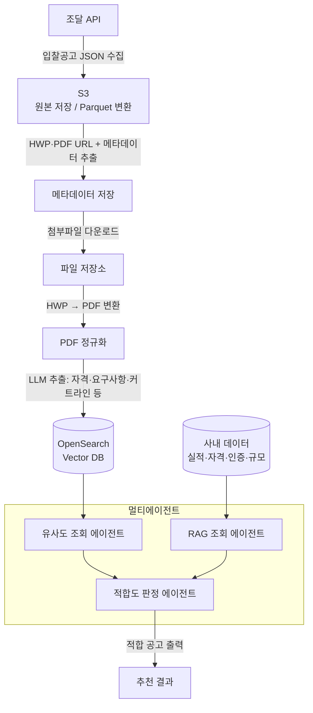

# bidding-agent

조달 입찰공고를 자동으로 수집·분석하고, 회사의 사내 데이터와 대조하여 **참여 가능한(적합한) 공고만 골라주는** 멀티에이전트 시스템입니다.

---

## 배경 & 목적

입찰을 희망하는 기업은 자신이 참여 가능한 공고를 찾는 데 막대한 시간과 인력을 소모합니다. 제안요청서(RFP), 기술요구사항, 입찰 자격 요건 등을 일일이 읽고 자사가 해당되는지 직접 판단해야 하기 때문입니다.

이 프로젝트는 **회사의 데이터(보유 실적, 자격, 인증, 규모 등)를 미리 입력해두면, 에이전트가 신규 입찰공고를 분석해 적합 여부를 자동으로 판단하고 적합한 공고만 추천**하는 것을 목표로 합니다.

---

## 핵심 기능

- 조달 API에서 입찰공고를 주기적으로 수집·저장
- 공고 첨부파일(HWP·PDF) 자동 다운로드 및 PDF 변환
- LLM으로 공고 문서에서 필요한 항목만 구조화 추출
- 추출 내용을 벡터 DB(OpenSearch)에 임베딩 저장
- 멀티에이전트가 사내 데이터 + 공고 DB를 교차 검색해 적합도 판정
- 적합 판단을 **(1) 입찰 자격**과 **(2) 커트라인** 두 단계로 수행

---

## 시스템 아키텍처



---

## 데이터 파이프라인

전체 흐름은 수집 → 정제 → 추출 → 적재 → 판단의 5단계로 구성됩니다.

**1. 공고 수집 (조달 API → S3)**
조달 API를 호출해 입찰공고를 JSON으로 받아 S3에 저장합니다. 대용량·반복 분석을 고려해 Parquet 변환 적재 여부를 함께 검토합니다.

**2. 메타데이터·첨부 URL 추출**
S3에 저장된 공고 데이터에서 HWP·PDF 첨부파일의 다운로드 URL과 공고번호, 기관명, 마감일 등 기타 메타데이터를 추출해 저장합니다.

**3. 첨부파일 다운로드**
추출한 URL로 첨부파일(HWP·PDF)을 내려받아 저장소에 보관합니다.

**4. 문서 정규화 (HWP → PDF)**
분석 일관성을 위해 HWP 파일을 PDF로 변환하여 모든 문서를 동일한 형식으로 맞춥니다.

**5. 핵심 정보 추출 & 벡터 적재**
전체 PDF에서 LLM으로 입찰 자격, 기술요구사항, 평가 커트라인 등 필요한 항목만 구조화하여 추출하고, 임베딩 후 OpenSearch 벡터 DB에 저장합니다.

---

## 멀티에이전트 구조

세 개의 에이전트가 역할을 나눠 적합 공고를 도출합니다.

### 1. 유사도 조회(검색) 기반 에이전트
벡터 DB에 저장된 공고 임베딩과 회사의 사업 영역·키워드를 **의미 기반 유사도**로 비교해, 우선 검토할 후보 공고를 빠르게 좁힙니다.

### 2. RAG 조회 에이전트
후보 공고에 대해 사내 데이터(보유 실적, 자격증, 인증, 기업 규모 등)와 공고 원문을 검색·결합하여, 판단에 필요한 **근거 컨텍스트**를 구성합니다.

### 3. 적합도 판정 에이전트
RAG가 모은 근거를 바탕으로 최종 적합 여부를 판단하고, 적합한 공고를 출력합니다. 판단은 두 단계로 진행됩니다.

- **입찰 자격 판단**: 공고가 요구하는 필수 자격(면허, 인증, 실적 요건, 지역 제한 등)을 회사가 충족하는지 확인
- **커트라인 판단**: 평가 항목·배점 기준에서 회사가 통과선(커트라인)을 넘길 수 있는지 추정

---

## 적합도 판단 로직

```
공고 후보
  └─ ① 입찰 자격 판단
        ├─ 미충족 → 제외
        └─ 충족 → ② 커트라인 판단
                    ├─ 미달 예상 → 보류/제외
                    └─ 통과 예상 → 적합 공고로 추천
```

자격을 만족하지 못하면 즉시 제외하여 불필요한 분석을 줄이고, 자격을 통과한 공고만 커트라인 평가로 넘겨 효율을 높입니다.

---

## 기술 스택

| 영역 | 사용 기술 |
|------|-----------|
| 데이터 수집 | 조달 API |
| 스토리지 | AWS S3 (원본 / Parquet) |
| 문서 처리 | HWP → PDF 변환, PDF 파싱 |
| 정보 추출 | LLM |
| 벡터 DB | OpenSearch |
| 에이전트 | 멀티에이전트 (유사도 조회 / RAG / 적합도 판정) |

> 구체적 프레임워크·모델명은 구현 확정 시 업데이트 예정입니다.

---

## 디렉토리 구조 (예시)

```
.
├── ingestion/        # 조달 API 수집, S3 적재
├── preprocessing/    # 메타데이터 추출, 다운로드, HWP→PDF 변환
├── extraction/       # LLM 기반 항목 추출
├── indexing/         # 임베딩 및 OpenSearch 적재
├── agents/
│   ├── similarity_agent.py   # 유사도 조회 에이전트
│   ├── rag_agent.py          # RAG 조회 에이전트
│   └── suitability_agent.py  # 적합도 판정 에이전트
├── data/             # 사내 데이터 (실적·자격·인증 등)
└── README.md
```

---

## 시작하기

```bash
# 1. 의존성 설치
pip install -r requirements.txt

# 2. 환경변수 설정 (.env)
#    조달 API 키, AWS 자격증명, OpenSearch 엔드포인트, LLM API 키 등

# 3. 파이프라인 실행 (수집 → 적재)
python -m ingestion.run

# 4. 에이전트 실행 (적합 공고 추천)
python -m agents.run --company data/company_profile.json
```

### 필요한 환경변수 (예시)

```
PROCUREMENT_API_KEY=      # 조달 API 키
AWS_ACCESS_KEY_ID=
AWS_SECRET_ACCESS_KEY=
S3_BUCKET=
OPENSEARCH_ENDPOINT=
LLM_API_KEY=
```

---

## 향후 계획

- 공고 수집 자동 스케줄링(주기적 배치)
- 추천 결과에 대한 근거·점수 시각화
- 사내 데이터 입력 UI
- 적합도 판단 정확도 평가셋 구축

---

*본 README는 프로젝트 설계안을 기준으로 작성되었으며, 구현이 진행되며 갱신됩니다.*